# ChimeLauncher 操作マニュアル

対象：v1.3.4 / Build 20　作成日：2026年10月3日

初めて使う方から、ホーム画面を自分好みに整えたい方までの操作ガイドです。画像はAndroid 15の撮影用エミュレーター上で、v1.3.4 / Build 20を実行して撮影しています。表示するアプリや壁紙は一例です。Foldの展開例は仮想端末の画面幅を広げたもので、実機の開閉撮影ではありません。画面内の表記は日本語と英語が混在しています。Androidの設定画面やインストール画面の名称は端末によって異なります。

## 目次

1. [インストールと初期設定](#1-インストールと初期設定)
2. [画面の構成と基本操作](#2-画面の構成と基本操作)
3. [アプリを探す・起動する](#3-アプリを探す・起動する)
4. [ホームにアプリを追加する](#4-ホームにアプリを追加する)
5. [配置を編集する・元に戻す](#5-配置を編集する・元に戻す)
6. [Dockを使う](#6-Dockを使う)
7. [ウィジェットを使う](#7-ウィジェットを使う)
8. [ショートカットとAction](#8-ショートカットとAction)
9. [ホームページを管理する](#9-ホームページを管理する)
10. [表示設定と折りたたみ端末](#10-表示設定と折りたたみ端末)
11. [Chime Moments](#11-Chime Moments)
12. [DiscoverとGoogle Discover](#12-DiscoverとGoogle Discover)
13. [バックアップ・復元・機種変更](#13-バックアップ・復元・機種変更)
14. [アプリを更新する](#14-アプリを更新する)
15. [困ったときの対処](#15-困ったときの対処)

## 1. インストールと初期設定

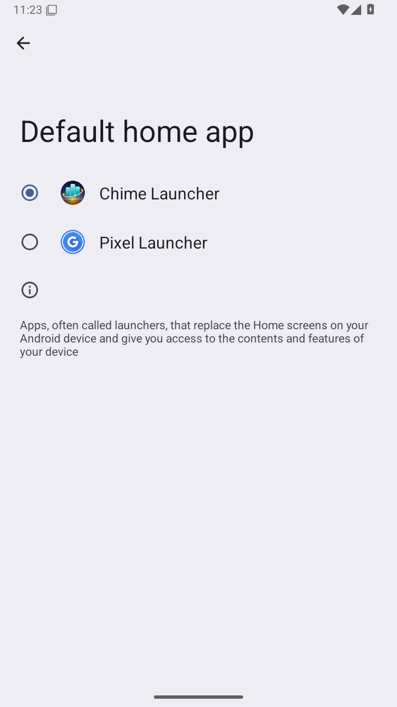

### APKをインストールする

1. 配布元の[GitHub Releases](https://github.com/tnk962/ChimeLauncher/releases/latest)を開きます。
2. 対象版のAssetsから本体のAPKをダウンロードします。v1.3.4の本体ファイル名は `ChimeLauncher-v1.3.4.apk` です。
3. Google Discoverも使う場合は、同じリリースの `ChimeDiscoverCompanion-v1.3.4.apk` をダウンロードします。
4. Google Discoverを使う場合はCompanion、本体の順にAPKを開いてインストールします。本体だけでもホーム・検索・独自フィードを利用できます。
5. Androidが提供元の許可を求めた場合は、APKを開いたブラウザーやファイルアプリの「不明なアプリのインストール」を許可します。画面の案内に従ってインストールを完了します。

ファイル名のバージョンは導入するリリースに合わせてください。APKは配布元を確認して取得します。警告内容が判断できない場合は、そこで操作を止めて確認してください。

### 標準のホームアプリにする

1. Chime Launcherを起動します。
2. 一番右の設定ページを開きます。ホームの空白を長押しし、「Launcher設定 & バックアップ」からも開けます。
3. 「システム設定 & ツール」までスクロールします。
4. 「デフォルトのホームアプリを選択」を押します。
5. Androidのホームアプリ選択画面でChime Launcherを選びます。
6. Androidのホーム操作でChime Launcherへ戻ることを確認します。

元のランチャーに戻すときも、ホームアプリの選択画面で変更できます。

### 任意の権限を設定する

|項目|有効にするとできること|操作する場所|
|---|---|---|
|使用状況へのアクセス|端末全体のアプリ利用履歴を「最近使った」「よく使う」に反映|設定 → システム設定 & ツール|
|Accessibility|ホームの下スワイプで通知パネルを開く補助|設定 → ジェスチャー|

使用状況へのアクセスを許可しなくても、Chime Launcher内のアプリ起動履歴を利用して検索候補を表示します。通知パネルが下スワイプで開けない場合は、「Accessibility権限設定を開く」から「Chime Launcher 通知シェード操作」を有効にします。

## 2. 画面の構成と基本操作

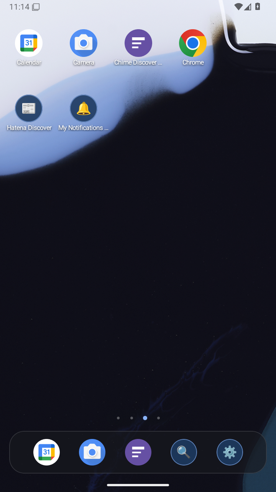

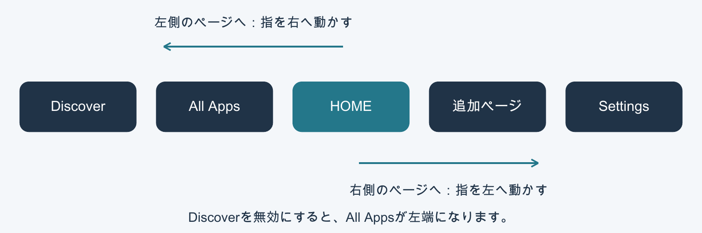

通常のページ順は、左から **Discover → All Apps → HOME → 追加したホームページ → Settings** です。Discoverを無効にするとAll Appsが最左になります。

「左側のページへ進む」は、画面上で指を右へ動かす操作です。「右側のページへ進む」は、指を左へ動かす操作です。

|操作|結果|
|---|---|
|ホーム上のアプリをタップ|アプリを起動|
|ホームの空白で上スワイプ|検索を開く|
|ホームの空白で下スワイプ|通知パネルを開く（設定・権限による）|
|左右にスワイプ|隣のページへ移動|
|ページインジケーターをタップ|選んだページへ移動|
|ホームの空白を長押し|「ホーム画面を編集」を開く|
|ページインジケーターを長押し|ホーム編集メニューを開く|
|アプリを長押しし、動かさず指を離す|アプリのメニューを表示|
|アプリを長押ししたまま動かす|ドラッグ操作を開始|

縦スクロールできるウィジェットの上では、そのウィジェットのスクロールが優先されます。検索や通知を開くときはホームの空白から操作してください。

## 3. アプリを探す・起動する

### All Appsを使う

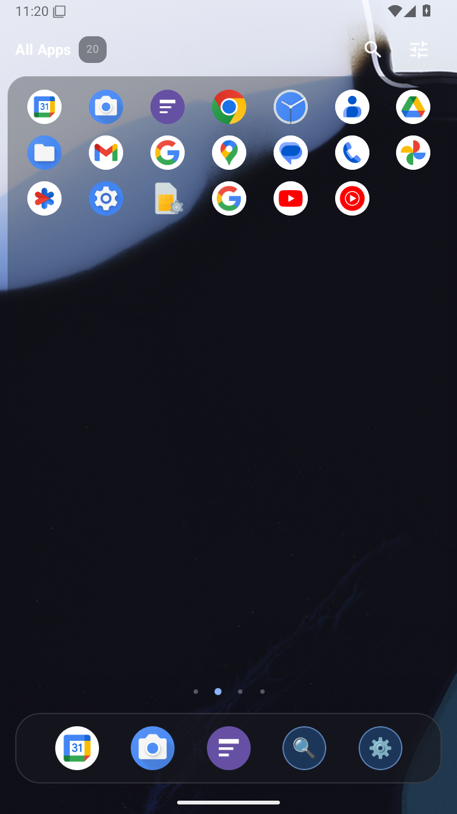

1. HOMEから右へ指を動かして、左隣のAll Appsへ移動します。
2. アプリ一覧をスクロールして探します。
3. アイコンをタップして起動します。

名前が見えにくい場合は、設定の「All Apps / Tiny Icons 設定」で「アプリ名ラベルを表示」をONにします。同じ設定で列数とアイコンサイズを調整できます。All Appsの表示メニューからも変更できます。

### 検索を使う

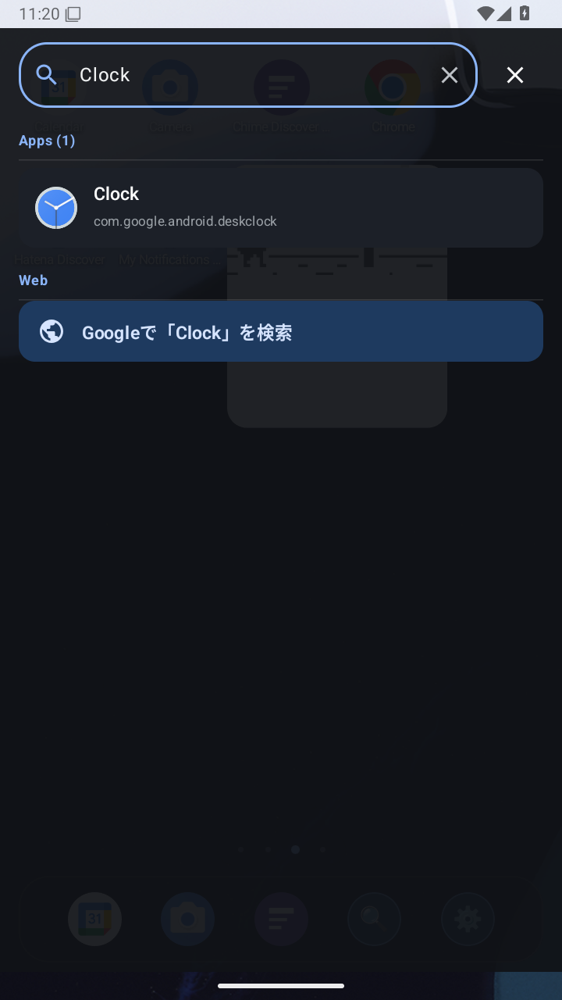

1. ホームの空白で上スワイプします。
2. 「Search apps」にアプリ名などを入力します。
3. 該当するアプリをタップします。

入力前には、履歴やインストール状況に応じて次の候補が表示されます。候補がないセクションは表示されない場合があります。

|画面の表示|意味|
|---|---|
|Recently Used|最近使ったアプリ|
|Frequently Used|よく使うアプリ|
|Recently Installed|直近30日以内にインストールされたアプリ|

文字を入力すると、アプリに加えて登録済みのショートカットやLauncher Actionも検索対象になります。Webで調べたいときは「Googleで『入力語句』を検索」を押します。検索結果の表示だけではWeb検索は実行されません。

## 4. ホームにアプリを追加する

### 空白長押しから追加する

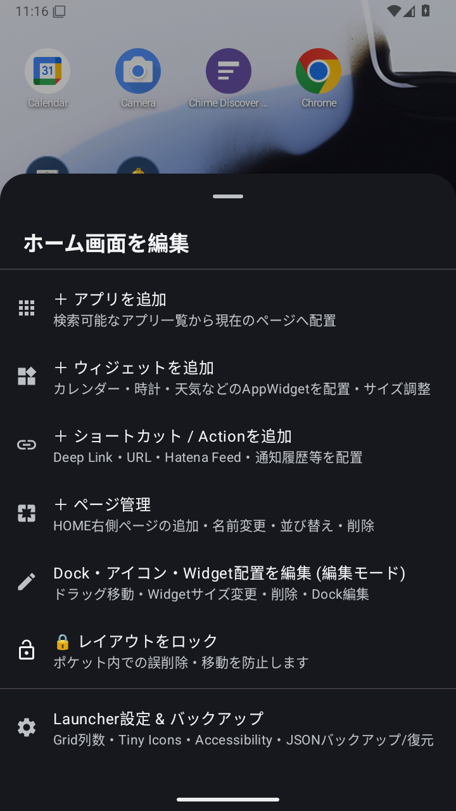

1. 配置したいホームページを表示します。
2. 空いている位置を長押しします。
3. 「＋ アプリを追加」を押します。
4. アプリ一覧から選択します。検索欄で絞り込めます。
5. ホームに追加されたことを確認します。

### All Appsのメニューから追加する

1. All Appsで対象アプリを長押しし、動かさず指を離します。
2. 「＋ HOME画面に追加」を押します。
3. 固定のHOMEページに追加されたことを確認します。

### 検索・All Appsからドラッグして追加する

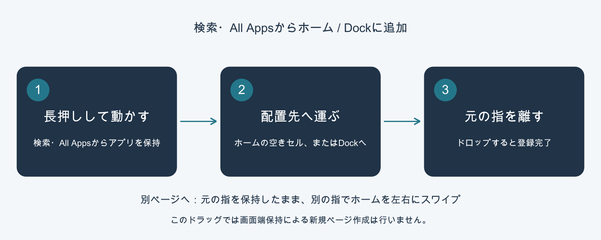

1. 検索結果、検索の未入力候補、またはAll Appsのアプリを長押しします。
2. 指を離さず動かしてドラッグを開始します。
3. ホームの空きセルへ運びます。
4. 指を離して登録します。

ドラッグ中に既存の別ホームページへ移動したい場合は、元の指でアイコンを保持したまま、もう1本の指でホーム領域を左右にスワイプして離します。その後、元の指を配置先で離します。

このドラッグでは画面端で保持してもページの自動作成は行いません。別ページを使う場合はあらかじめページを追加してください。空きセルがない場所や、レイアウトロック中には登録できません。

## 5. 配置を編集する・元に戻す

### 編集モードを開始する

1. ホームの空白を長押しします。
2. 「Dock・アイコン・Widget配置を編集 (編集モード)」を押します。
3. 上部に「元に戻す」「追加」「Widget」「ページ」「完了」が表示されます。
4. アイコンなどをドラッグして移動します。
5. 編集が終わったら「完了」を押します。

ホームのアイコンを長押しして「位置を移動 / 編集モード」から入る方法もあります。

### 別ページへ移動する

ホームに配置済みのアイコンやウィジェットは、画面端へドラッグして約0.65秒保持するとページを移動できます。条件に応じて追加ページも作成されます。検索・All Apps・Dockを起点とするドラッグとは動作が異なります。

長押しメニューの「『ページ名』へ移動」や「新しいページを作成して移動」を使えば、ドラッグを続けずに移動できます。

### アイコンをホームから取り除く

アイコンを長押しして「ホームから削除」を押します。編集モードでは削除ボタンも使えます。ホーム上の登録を削除する操作であり、アプリ自体のアンインストールではありません。

### 「元に戻す」を使う

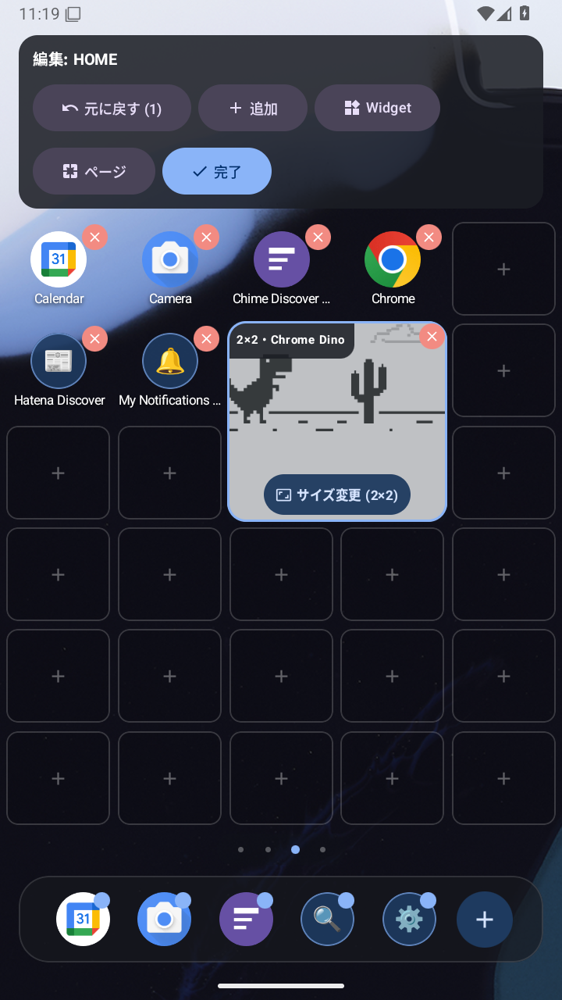

編集モード中は、上部の「元に戻す (操作数)」で直前の変更を取り消せます。最大20操作まで記録されます。

対象はホームのアイテム追加・移動・削除、ウィジェットのサイズ変更、Dockの編集、ページの追加・名前変更・並べ替え・削除です。グリッド数やDock位置などの設定変更は対象外です。

**「完了」、戻る、ホーム操作で編集を終了すると履歴は消えます。** アプリを再起動しても復活しません。Redoはありません。戻したい操作がある場合は編集を終了する前に実行してください。

ドラッグ中、処理中、ウィジェットの許可・初期設定待ち、レイアウトロック中などは実行できません。バックアップ復元や未インストールアプリの置き換えなどでも履歴は破棄されます。

### 誤操作を防ぐ

配置が決まったら、ホームの空白長押し →「レイアウトをロック」を使います。設定の「ホーム画面 & レイアウトロック」からも変更できます。再編集する場合は同じ場所でロックを解除します。

## 6. Dockを使う

Dockは、よく使うアプリなどを登録する画面下部または側面の領域です。

### 追加する

All Appsのアプリ長押しメニューで「＋ Dockに追加」を選ぶか、検索・All AppsからDockへドラッグします。編集モードではDockの追加枠からアイテムを選べます。

### 並べ替える・削除する

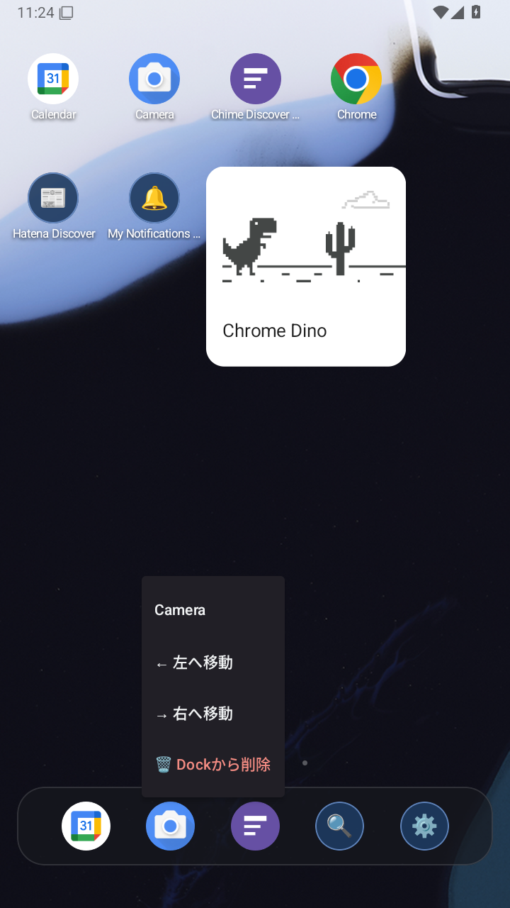

Dockのアイコンを長押ししたまま動かし、移動先で離すと、その位置に挿入して並べ替えます。Dockが満杯でも並べ替えは可能です。長押しメニューの左右移動（縦Dockでは上下移動）も使えます。

削除は「Dockから削除」を選びます。アプリ本体は削除されません。編集中の操作なら「元に戻す」の対象になります。

### 個数と位置を変更する

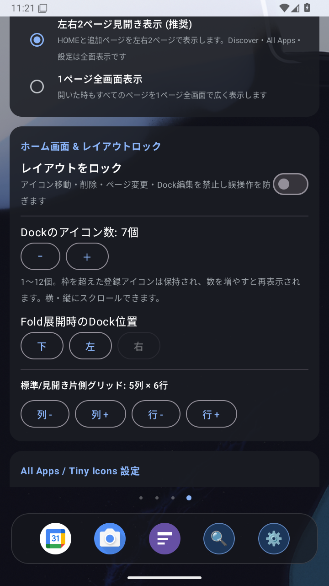

1. 設定 →「ホーム画面 & レイアウトロック」を開きます。
2. 「Dockのアイコン数」の「−」「＋」で1〜12個に変更します。初期値は7個です。
3. Fold展開時は「Fold展開時のDock位置」で下・左・右を選びます。初期値は右です。

個数を減らして枠から外れた登録アイコンは保持されます。個数を増やすと再表示されます。表示領域に入りきらない場合はDockをスクロールできます。

## 7. ウィジェットを使う

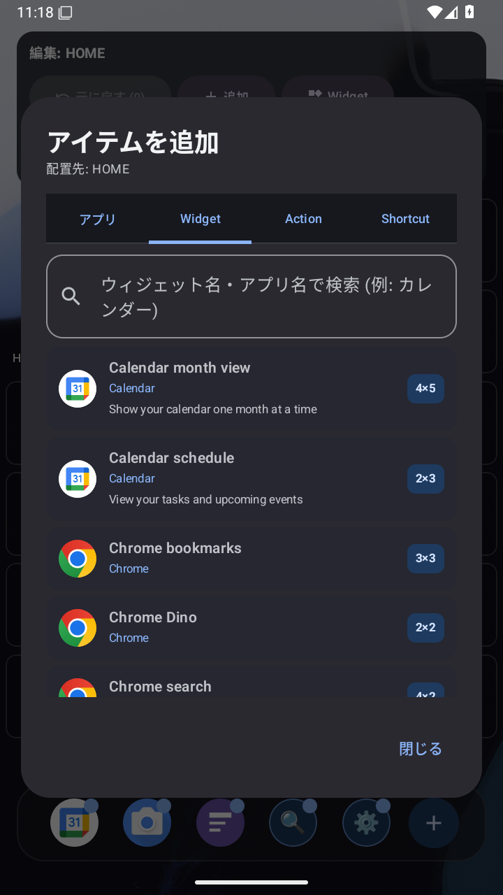

### 追加する

1. 配置したいページの空白を長押しします。
2. 「＋ ウィジェットを追加」を押します。
3. Widgetタブでアプリ名やウィジェット名を検索し、候補を選びます。
4. Androidの追加許可が表示されたら確認します。
5. 提供アプリの設定画面が開いた場合は設定を完了します。
6. ホームに表示されたことを確認します。

候補は端末にインストールされたアプリが提供するウィジェットです。アプリによってはウィジェットを提供していません。

### サイズを変更する

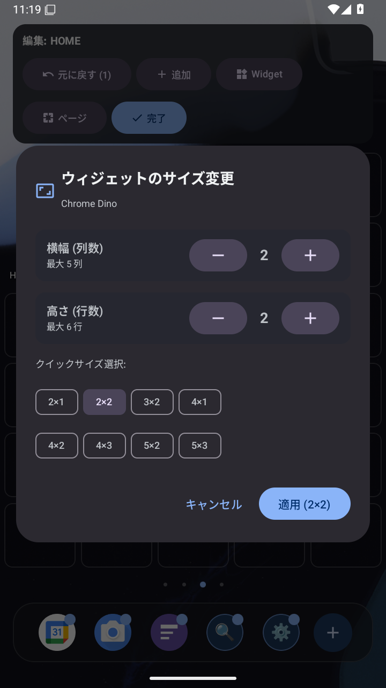

1. ウィジェットを長押しします。
2. 「サイズを変更」を押します。
3. 「横幅 (列数)」「縦幅 (行数)」の増減ボタン、またはクイックサイズを選びます。
4. 「適用 (横×縦)」を押します。

サイズはホームのセル数で指定します。画面のグリッド数や空き領域に合わせて調整してください。

### 復元後に表示されない場合

ウィジェットの登録情報は端末やランチャーに依存します。復元後は長押しメニューに「ウィジェットを再バインド」が出る場合があります。再度許可・設定するか、ウィジェットを追加し直してください。「ウィジェットの設定」は設定画面を持つウィジェットで利用できます。

## 8. ショートカットとAction

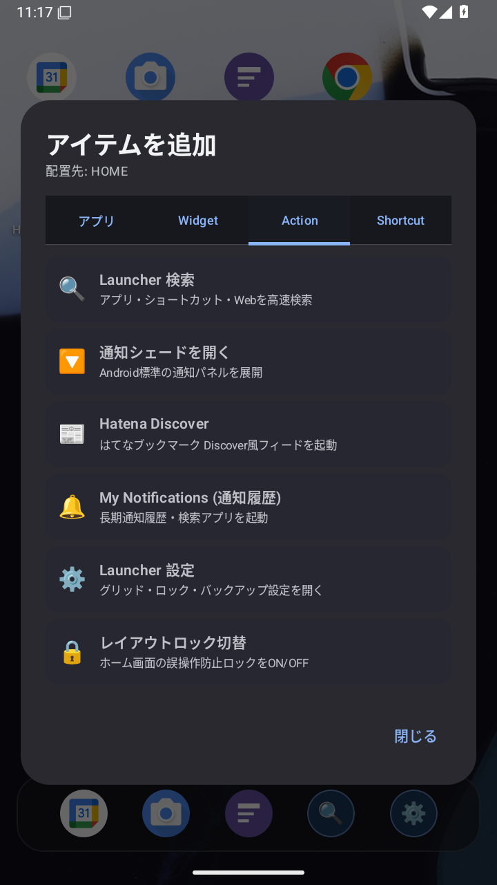

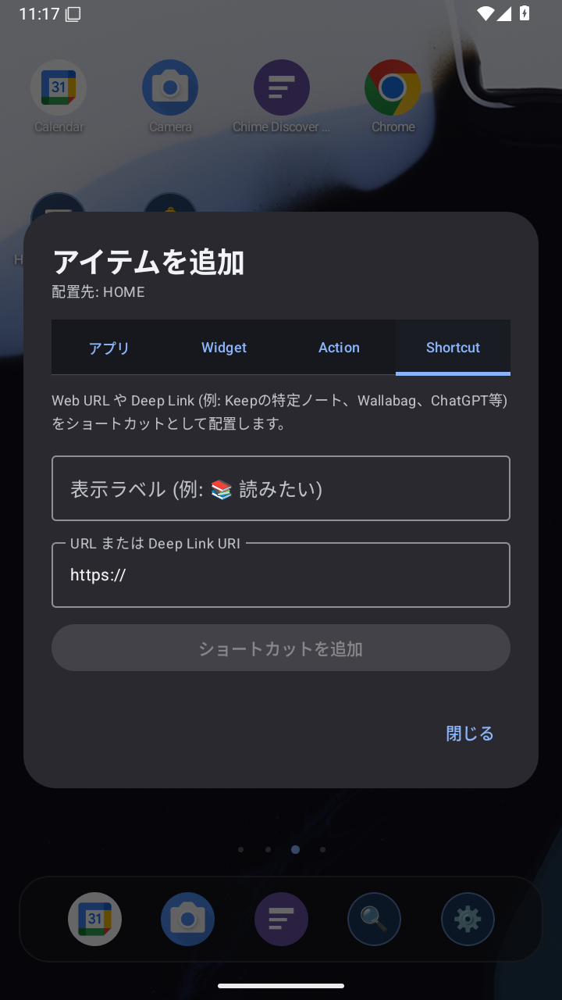

1. ホームの空白長押し →「＋ ショートカット / Actionを追加」を開きます。
2. ActionまたはShortcutタブを選びます。

ActionにはLauncher検索、通知シェード、Launcher設定、レイアウトロック切替などがあります。「Hatena Discover」「My Notifications」は対応する別アプリが必要です。Chime Discover Companionとは用途が異なります。

Shortcutでは「表示ラベル」と「URL または Deep Link URI」を入力し、「ショートカットを追加」を押します。Webページなら `https://` で始まるURLを指定します。Deep Linkは対象アプリが対応しているURIを使います。任意の画面やノートを必ず開けるわけではありません。

## 9. ホームページを管理する

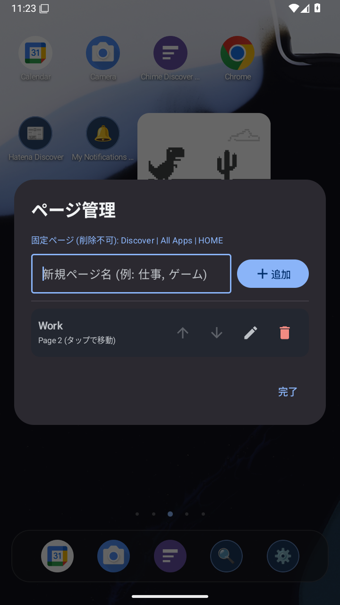

1. ホームの空白長押し →「＋ ページ管理」を押します。編集中は上部の「ページ」からも開けます。
2. 「新規ページ名」に「仕事」「ゲーム」などを入力して「追加」を押します。
3. 名前変更ボタンで名前を編集し「保存」を押します。
4. 上下矢印でページ順を変更します。上は左側、下は右側へ移す操作です。
5. 一覧のページ名をタップすると、そのページへ移動します。

削除できるのはHOMEの右側に追加したページです。Discover・All Apps・HOMEは固定ページです。追加ページを削除すると中の配置も削除されます。必要なら先にアイテムを移動するか、バックアップを作成してください。編集モード中の削除は「元に戻す」で復元できます。

## 10. 表示設定と折りたたみ端末

### ホームのグリッド

「ホーム画面 & レイアウトロック」で、閉じた画面と開いた画面の列・行を調整できます。初期値は閉じた画面が5列×6行、開いた画面が8列×6行です。大きく変更する前にバックアップを作り、変更後は両方の画面でアイコン・ウィジェットの位置を確認してください。

### Fold展開時のページ表示

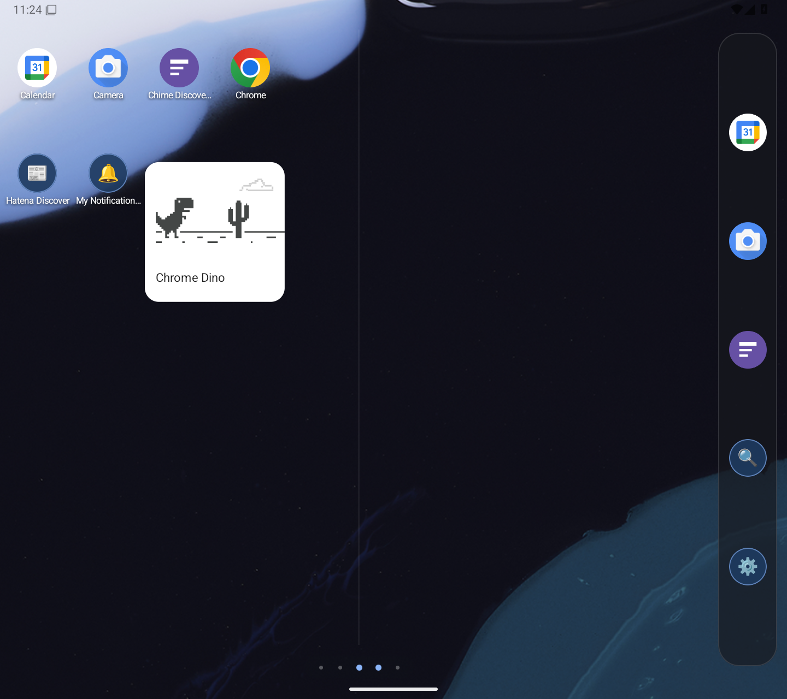

「Fold展開時 (開いた画面) の表示設定」で選びます。

|モード|表示|
|---|---|
|左右2ページ見開き表示 (推奨)|HOMEと追加ホームページを見開きで表示。HOMEしかない場合は1ページ|
|1ページ全画面表示|ホームページを1ページずつ大きく表示|

Discover・All Apps・設定は、どちらのモードでも1ページ全面表示です。Foldを閉じると1ページ表示・下部Dockに戻ります。

### All Appsの見やすさ

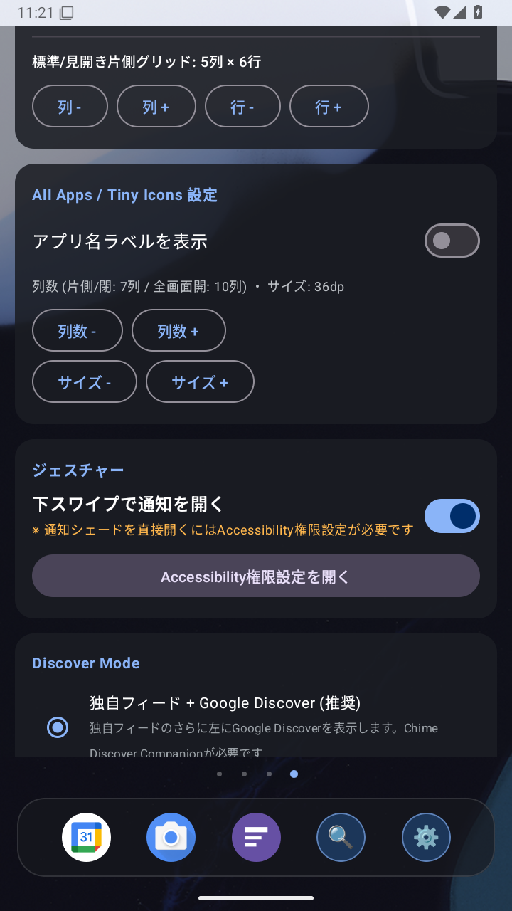

「All Apps / Tiny Icons 設定」でアプリ名ラベル、列数、サイズを変更します。初期値は閉じた画面7列、開いた画面10列、サイズ36dp、ラベル非表示です。名前で探したい場合はラベル表示をONにし、タップしづらい場合はアイコンを大きくするか列数を減らします。

### ページインジケーター

「表示 (Indicator Style)」でDots・Icons・Textを選びます。Dotsは点、Iconsはページの種類を表すアイコン、TextはDiscover・Apps・番号・Settingsなどの文字で表示します。

## 11. Chime Moments

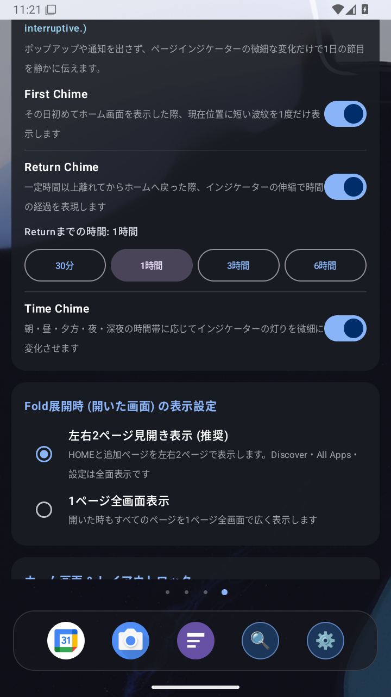

Chime Momentsはページインジケーターの動きや灯りで時間の節目を伝える機能です。設定の「Chime Moments」でそれぞれON/OFFできます。

|機能|タイミング|表現|
|---|---|---|
|First Chime|その日初めてホームを表示|現在位置に短い波紋を1回表示|
|Return Chime|一定時間離れてホームへ戻ったとき|インジケーターの伸縮|
|Time Chime|朝・昼・夕方・夜・深夜|時間帯による灯りの変化|

Returnまでの時間は30分・1時間・3時間・6時間から選べます。初期値は1時間です。First・Returnの切替では設定内に動きのプレビューが表示されます。

## 12. DiscoverとGoogle Discover

### 独自フィードを読む

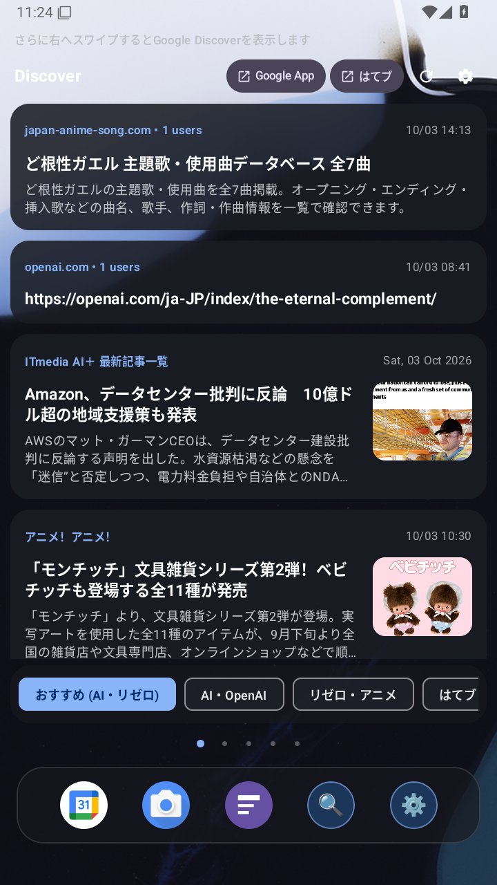

HOMEから右へ指を動かしてAll Appsへ進み、もう一度右へ動かすとDiscoverです。画面下部のカテゴリから「おすすめ (AI・リゼロ)」「AI・OpenAI」「リゼロ・アニメ」「はてブ 総合」「はてブ IT」「ビジネス・政治」を選びます。記事を縦にスクロールし、カードをタップして記事を開きます。

記事の取得には通信が必要です。失敗した場合は接続を確認して「再試行」を押します。

### Google Discoverを使う

1. Googleアプリをインストール・有効化します。
2. 本体と同じリリースのChime Discover Companionを導入します。
3. Chime Launcherを標準ホームに設定します。
4. 設定 →「Discover Mode」で「独自フィード + Google Discover (推奨)」を選びます。
5. 独自フィードまで移動し、さらに右方向へ指を動かしてGoogle Discoverを開きます。

Google DiscoverはGoogleアプリが提供する画面です。Googleアプリのバージョンや端末によって接続できない場合があります。独自フィード上部の状態表示を確認してください。

### Discover Modeの違い

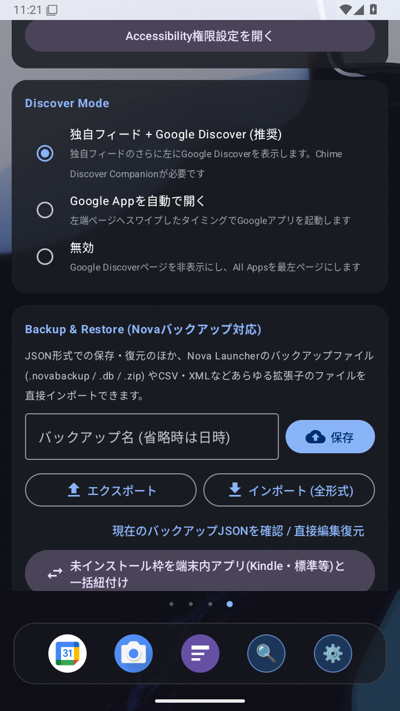

|選択肢|動作|
|---|---|
|独自フィード + Google Discover (推奨)|独自フィードのさらに左にGoogle Discoverを表示。Companionが必要|
|Google Appを自動で開く|左端へ移動したタイミングでGoogleアプリを別画面として起動|
|無効|Discoverページを非表示にし、All Appsを最左にする|

Companionがなくても独自フィードは使えます。Googleアプリを別画面で開く場合は、フィード上の「Google App」ボタンを使います。

## 13. バックアップ・復元・機種変更

### 「保存」と「エクスポート」の違い

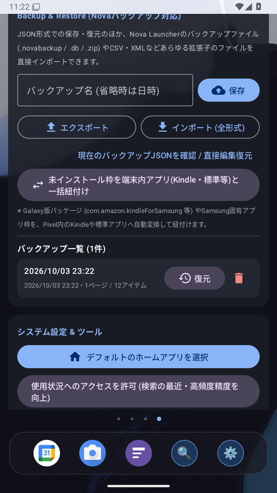

|操作|用途|
|---|---|
|保存|アプリ内に現在の配置と設定のスナップショットを保持|
|エクスポート|JSONファイルとして指定した保存先へ書き出す|
|復元|アプリ内の保存済みスナップショットを適用|
|インポート (全形式)|ファイルを読み込んで配置を復元・変換|

機種変更やアプリの削除に備える場合は、アプリ内の「保存」だけでなく「エクスポート」も行い、ファイルを別の保存先へ保管してください。バックアップはアプリ本体や各アプリの内部データを保存するものではありません。

### バックアップを作る

1. 設定 →「Backup & Restore (Novaバックアップ対応)」を開きます。
2. 「バックアップ名」に用途の分かる名前を入力して「保存」を押します。省略時は日時が名前になります。
3. 外部ファイルが必要なら「エクスポート」を押します。
4. Androidのファイル保存画面で保存先と名前を指定します。

保存対象にはホームページ・配置アイテム・Dock・Launcher設定が含まれます。Dockの個数とFold展開時のDock位置も含まれます。

### 復元する

アプリ内のバックアップなら一覧の「復元」、JSONファイルなら「インポート (全形式)」からファイルを選びます。**復元は現在の配置・設定を置き換えるため、先に現在の状態をバックアップしてください。** Undo履歴では復元前の状態へ戻せません。

ウィジェットは再許可や再設定が必要になる場合があります。復元後はホーム・Dock・追加ページ・開閉両方の配置を確認します。

### Nova Launcherから移行する

Nova側でバックアップを作成し、Chime Launcherの「インポート (全形式)」から `.novabackup`・`.db`・`.zip` などを選びます。ファイルを選べることと完全互換は別で、内容の形式によって読み込めない場合があります。

Novaの見た目や機能をそのまま再現する移行ではありません。フォルダ内アプリはホーム上のアイコンへ展開され、Novaのウィジェットはこの変換では移行されません。ウィジェットはChime側で追加し直してください。XML・CSVなどの変換も、対応する配置情報が含まれるファイルが対象です。

### 未インストールの枠を直す

別端末へ移行すると、Samsung専用アプリなどのパッケージが存在しない場合があります。対象の枠をタップして表示された案内から、インストール候補の検索や、端末内のアプリへの置き換えを行います。

複数の枠を処理する場合は、設定の「未インストール枠を端末内アプリと一括自動紐付け」を使います。処理後は意図したアプリが起動するか確認してください。

「現在のバックアップJSONを確認 / 直接編集復元」は高度な操作です。通常はファイルのエクスポート・インポートを使ってください。

## 14. アプリを更新する

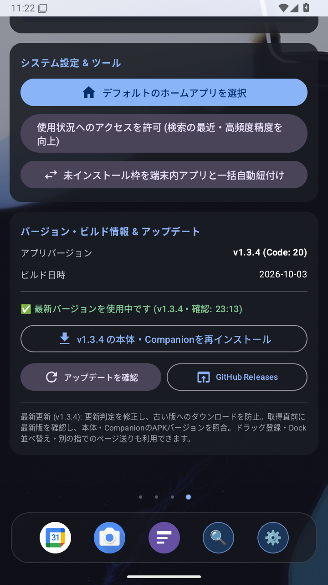

1. 設定ページを開きます。更新が見つかると上部に案内が表示されます。
2. 手動で確認する場合は最下部の「バージョン・ビルド情報 & アップデート」へ進みます。
3. 「アップデートを確認」を押します。
4. 新しい版がある場合は本体・Companionの更新ボタンを押します。
5. ダウンロード完了後、必要に応じて「不明なアプリのインストール許可」を設定します。
6. Companionが取得された場合はCompanionを先にインストールします。
7. 設定画面へ戻り、本体をインストールします。各APKでAndroidの確認が必要です。
8. 更新後に設定画面のバージョン・ビルド情報を確認します。

同じ版なら「最新バージョンを使用中」と表示されます。公開版より新しい版が入っている場合はその状態を表示し、古い版への更新を防ぎます。新しいCompanionが入っている場合もダウングレードしません。

更新でインストールエラーが出た場合は、エラー内容を確認してください。署名が違うAPKは上書きできません。配置を失わないよう、原因を確認する前にアプリを削除しないでください。

## 15. 困ったときの対処

|症状|確認・対処|
|---|---|
|ホーム操作で別ランチャーへ戻る|「デフォルトのホームアプリを選択」でChime Launcherを選ぶ|
|検索や通知がスワイプで開かない|編集モードやダイアログを閉じ、ウィジェット上を避けてホームの空白から操作。通知はジェスチャー設定とAccessibilityも確認|
|アプリを追加・移動できない|レイアウトロック、空きセル、Dock上限を確認|
|長押しでメニューが出ない|指を動かさず長押し後に離す。動かすとドラッグになる|
|検索の最近・高頻度候補が少ない|起動履歴を蓄積する。必要なら使用状況へのアクセスを許可|
|Dockのアイコンが消えた|Dock個数を減らしていないか確認。増やすと保持済みアイコンが再表示|
|「元に戻す」が使えない|編集モード内で履歴があるか確認。ドラッグ・処理・許可待ちを終え、ロックを解除|
|Google Discoverが開かない|Googleアプリ、本体とCompanionの組合せ、標準ホーム、Discover Mode、状態表示を確認。Google Appボタンも利用可能|
|フィードが読み込めない|通信を確認して再試行。カテゴリを変えて取得状況を確認|
|復元したアイコンが起動しない|対象アプリの導入・置き換え・一括自動紐付けを検討|
|復元したウィジェットが表示されない|再バインド、提供アプリの導入、追加し直しを行う|
|更新できない|通信・提供元のインストール許可・表示されたAndroidエラーを確認|

解決しない場合は、設定画面のバージョンとBuild番号、端末名、Androidバージョン、再現手順、エラー文を記録すると調査しやすくなります。

## このマニュアルの確認範囲

本書は作業フォルダ内のv1.3.4のコード・README・既存資料を確認して作成しています。撮影用アプリの設定画面ではv1.3.4を最新として表示しました。外部リリースの添付APKや署名は本書作成の検証対象ではありません。Google Discoverは画面の起動まで確認し、記事一覧の表示は確認できていません。Androidのシステム画面やGoogle Discoverの表示は環境によって異なります。
